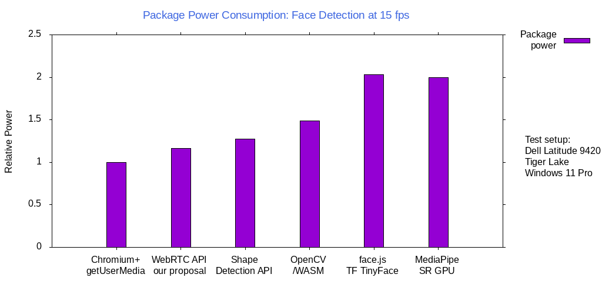

# Face Detection

## Authors:

- Rijubrata Bhaumik, Intel Corporation
- Tuukka Toivonen, Intel Corporation

## Participate
- github.com/riju/faceDetection/issues/

## Introduction

Face Detection is the process of detecting human faces in a given scene and distinguishing them from other objects. There are multiple ways to perform face detection on the Web. Libraries and ML frameworks (with WebAssembly and WebGL backend) exist, both proprietary and open source, which can perform  face detection either in client within the browser or using a vendor cloud service. Computation in vendor cloud adds latencies depending on network speed and adds dependency to third party service. 

[Shape Detection API has a FaceDetector](https://wicg.github.io/shape-detection-api/) which enables Web applications to use a system provided face detector, but it requires image data to be provided by the Web app itself. It surely helps that it works on images to detect faces, but from a video conference perspective, it means the app would first need to capture frames from a camera and then feed them as input to the Shape Detection API. Many platforms offer a camera API which can perform face detection directly on image frames from the system camera. Cameras run a face detection algorithm by default to make their 3A algorithms work better. Both Microsoft and ChromeOS offer native platforms APIs to hook into those algorithms and offer performant face detection to the Web.


## Goals 

* Face Detection API should be anchored to [VideoFrame](https://www.w3.org/TR/webcodecs/#videoframe-interface) defined in WebCodecs instead of [MediaStreamTrack](https://www.w3.org/TR/mediacapture-streams/#dom-mediastreamtrack).

* Face Detection API should be anchored to [VideoFrameMetadata](https://wicg.github.io/video-rvfc/#dictdef-videoframemetadata) defined in [HTMLVideoElement.requestVideoFrameCallback](https://wicg.github.io/video-rvfc/).

* Face Detection API should try to return a **contour** instead of a bounding box. The number of points describing the contour  can be user defined via **faceDetectionMode** settings and implementations presently can default to a four point rectangle.

* Face Detection API should allow face tracking.

* Face Detection API should work with [TransformStream](https://developer.mozilla.org/en-US/docs/Web/API/TransformStream).

* Face Detection API could be used as an input to various other APIs like Background Blur, Eye Gaze Correction, Face Framing, etc. Face Detection minimizes the surface area other dependent features need to work on for a faster implementation. It should be easy to use Face Detection API along with a custom Eye Gaze Correction or a Funny Hats feature from a ML framework by passing the face coordinates.

* In the spirit of successive enhancement, it should be possible to get results from Face Detection API and add custom enhancements before feeding the metadata to the video stream.

* Facial Landmarks like *eyes*, *nose* and *mouth* should be detected if there's support in the platform.

## Non-goals

* Face Detection API does not need to support facial expressions. Many platforms do support **BLINK** and **SMILE** and ML Frameworks do support a diverse set of expressions, usually **ANGER**, **DISGUST**, **FEAR**, **HAPPINESS**, **SADNESS**, **SURPRISE**; **NEUTRAL**, etc.  [Many](https://www.w3.org/2021/11/24-webrtc-minutes.html#t04) felt expressions being more subjective and there’s a concern about the expression detection going wrong.

* Face Detection API does not need to return a mesh corresponding to the detected faces. Even though TensorFlow returns a 468 landmark FaceMesh and most DNNs can return something similar, mesh is not supported on any platforms presently, and for the sake of simplicity, it is excluded for now. However, in the long term it may be appropriate to extend the face detection API to be able to also return mesh-based face detection results. This is left for future work.

## Platform Support 


| OS               | API              | FaceDetection|
| ------------- |:-------------:| :-----:|
| Windows      | Media Foundation|   [KSPROPERTY_CAMERACONTROL_EXTENDED_FACEDETECTION ](https://docs.microsoft.com/en-us/windows-hardware/drivers/stream/ksproperty-cameracontrol-extended-facedetection?redirectedfrom=MSDN)|
| ChromeOS/Android      | Camera HAL3 | [STATISTICS_FACE_DETECT_MODE_FULL  ](https://developer.android.com/reference/android/hardware/camera2/CameraMetadata#STATISTICS_FACE_DETECT_MODE_FULL)[STATISTICS_FACE_DETECT_MODE_SIMPLE ](https://developer.android.com/reference/android/hardware/camera2/CameraMetadata#STATISTICS_FACE_DETECT_MODE_SIMPLE)|
| Linux | GStreamer      |    [facedetect ](https://gstreamer.freedesktop.org/data/doc/gstreamer/head/gst-plugins-bad/html/gst-plugins-bad-plugins-facedetect.html)|
| macOS| Core Image Vision|    [CIDetectorTypeFace ](https://developer.apple.com/documentation/coreimage)[VNDetectFaceRectanglesRequest](https://developer.apple.com/documentation/vision/vndetectfacerectanglesrequest)|


## Performance

Face detection, using the proposed Javascript API, was compared to several other alternatives in power usage.
The results were normalized against base case (viewfinder only, no face detection) and are shown in the following chart.



Javacript test programs were created to capture frames and to detect faces at VGA resolution (640x480) at 15 fps. The tests were run on Intel Tigerlake running Windows 11. A test run length was 120 seconds (2 minutes) with 640x480 pixel frame resolution. 

## Face Detection API


```js
partial interface VideoFrame {
  readonly attribute FrozenArray<DetectedFace>? detectedFaces;
};

partial dictionary VideoFrameMetadata {
  FrozenArray<DetectedFace> detectedFaces;
};

dictionary DetectedFace {
  required long                     id;
  required float                    probability;
  FrozenArray<Point2D>              contour;
  FrozenArray<DetectedFaceLandmark> landmarks;
};

dictionary DetectedFaceLandmark {
  required FrozenArray<Point2D> contour;
  FaceLandmark                  type;
};

enum FaceLandmark {
  "eye",
  "eyeLeft",
  "eyeRight",
  "mouth",
  "nose"
};

partial dictionary MediaTrackSupportedConstraints {
  boolean faceDetectionMode = true;
  boolean faceDetectionLandmarks = true;
  boolean faceDetectionMaxNumFaces = true;
};

partial dictionary MediaTrackCapabilities {
  sequence<DOMString> faceDetectionMode;
  sequence<boolean>   faceDetectionLandmarks;
  ULongRange          faceDetectionMaxNumFaces;
};

partial dictionary MediaTrackConstraintSet {
  ConstrainDOMString faceDetectionMode;
  ConstrainBoolean   faceDetectionLandmarks;
  ConstrainULong     faceDetectionMaxNumFaces;
};

partial dictionary MediaTrackSettings {
  DOMString faceDetectionMode;
  boolean   faceDetectionLandmarks;
  long      faceDetectionMaxNumFaces;
};

enum FaceDetectionMode {
  "none",         # Face detection is not needed
  "presence",     # Only the presence of face or faces is returned, not location
  "bounding-box", # Return bound box for face
  "contour",      # Approximate contour of the detected faces is returned
};

```
[PR](https://github.com/w3c/mediacapture-extensions/pull/48)


## Key scenarios


## Examples

### Example 1

```js
// main.js:
// Check if face detection is supported by the browser
const supports = navigator.mediaDevices.getSupportedConstraints();
if (supports.faceDetectionMode) {
  // Browser supports face contour detection.
} else {
  throw('Face contour detection is not supported');
}

// Open camera with face detection enabled
const stream = await navigator.mediaDevices.getUserMedia({
  video: { faceDetectionMode: 'bounding-box' }
});
const [videoTrack] = stream.getVideoTracks();

// Use a video worker and show to user.
const videoElement = document.querySelector("video");
const videoGenerator = new MediaStreamTrackGenerator({kind: 'video'});
const videoProcessor = new MediaStreamTrackProcessor({track: videoTrack});
const videoSettings = videoTrack.getSettings();
const videoWorker = new Worker('video-worker.js');
videoWorker.postMessage({
  videoReadable: videoProcessor.readable,
  videoWritable: videoGenerator.writable
}, [videoProcessor.readable, videoGenerator.writable]);
videoElement.srcObject = new MediaStream([videoGenerator]);
videoElement.onloadedmetadata = event => videoElement.play();

// video-worker.js:
self.onmessage = async function(e) {
  const videoTransformer = new TransformStream({
    async transform(videoFrame, controller) {
      for (const face of videoFrame.detectedFaces) {
        console.log(
          `Face @ (${face.contour[0].x}, ${face.contour[0].y}), ` +
                 `(${face.contour[1].x}, ${face.contour[1].y}), ` +
                 `(${face.contour[2].x}, ${face.contour[2].y}), ` +
                 `(${face.contour[3].x}, ${face.contour[3].y})`);
      }
      controller.enqueue(videoFrame);
    }
  });
  e.data.videoReadable
  .pipeThrough(videoTransformer)
  .pipeTo(e.data.videoWritable);
}
```

### Example 2

```js
function updateCanvas(now, metadata) {
  const canvasCtx.drawImage(video, 0, 0, canvas.width, canvas.height);
  for (const face of (metadata.detectedFaces || [])) {
    if (!face.contour || !face.contour.length)
      continue;
    canvasCtx.beginPath();
    canvasCtx.moveTo(face.contour[0].x, face.contour[0].y);
    for (const point of face.contour.slice(1))
      canvasCtx.lineTo(point.x, point.y);
    canvasCtx.closePath();
    canvasCtx.strokeStyle = 'red';
    canvasCtx.stroke();
  }
  videoElement.requestVideoFrameCallback(updateCanvas);
}

// Check if face detection is supported by the browser
const supports = navigator.mediaDevices.getSupportedConstraints();
if (supports.faceDetectionMode) {
  // Browser supports face contour detection.
} else {
  throw('Face contour detection is not supported');
}

// Open camera with face detection enabled
const stream = await navigator.mediaDevices.getUserMedia({
  video: { faceDetectionMode: ['contour', 'bounding-box'] }
});

// Show to user.
const canvasElement = document.querySelector("canvas");
const canvasCtx = canvasElement.getContext("2d");
const videoElement = document.querySelector("video");
videoElement.srcObject = new MediaStream([videoGenerator]);
videoElement.onloadedmetadata = event => videoElement.play();
videoElement.requestVideoFrameCallback(updateCanvas);
```

## Stakeholder Feedback / Opposition

[Implementors and other stakeholders may already have publicly stated positions on this work. If you can, list them here with links to evidence as appropriate.]

- [Teams] : No signals
- [Zoom] : No signals
- [WebEx] : No signals
- [Firefox] : No signals
- [Safari] : No signals

[If appropriate, explain the reasons given by other implementors for their concerns.]

## References & acknowledgements

Many thanks for valuable feedback and advice from:

- Eero Häkkinen
- Bernard Aboba
- Harald Alvestrand
- Jan-Ivar Bruaroey
- Youenn Fablet
- Dominique Hazael-Massieux

## Disclaimer

Intel is committed to respecting human rights and avoiding complicity in human rights abuses. See Intel's Global Human Rights Principles. Intel's products and software are intended only to be used in applications that do not cause or contribute to a violation of an internationally recognized human right.

Intel technologies may require enabled hardware, software or service activation.

No product or component can be absolutely secure.

Your costs and results may vary.

© Intel Corporation
